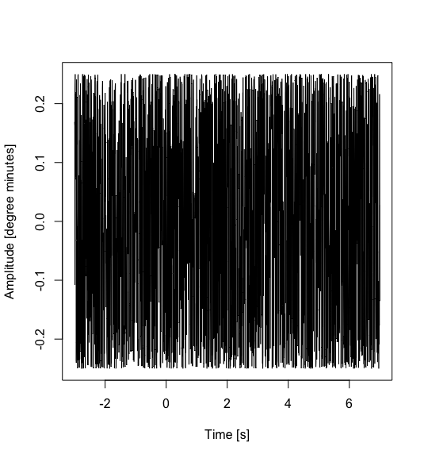
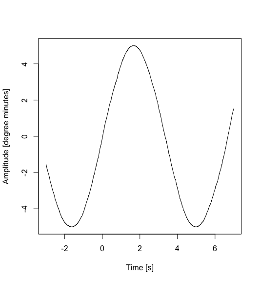
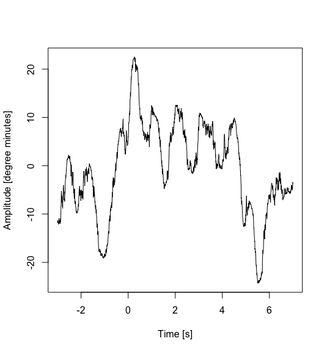

# SampleScene

## The World

This world is scaled x100.
If real world size is 3 cm, then 3 m in this scene.

## Values

### Tremore

80 Hz, 15 Degree Seconds.

### Drift

0.1 Hz, 180 Degree Seconds.

### Flick

2 Hz, 1800 Degree Seconds.

## Concrete Data

### Common Data

```R
> head((x <- seq(-3, 7, by = 1/200) * 2 * pi), n = 50)
 [1] -18.84956 -18.81814 -18.78672 -18.75531 -18.72389 -18.69248 -18.66106
 [8] -18.62964 -18.59823 -18.56681 -18.53540 -18.50398 -18.47256 -18.44115
[15] -18.40973 -18.37832 -18.34690 -18.31549 -18.28407 -18.25265 -18.22124
[22] -18.18982 -18.15841 -18.12699 -18.09557 -18.06416 -18.03274 -18.00133
[29] -17.96991 -17.93849 -17.90708 -17.87566 -17.84425 -17.81283 -17.78141
[36] -17.75000 -17.71858 -17.68717 -17.65575 -17.62433 -17.59292 -17.56150
[43] -17.53009 -17.49867 -17.46726 -17.43584 -17.40442 -17.37301 -17.34159
[50] -17.31018
> wave <- function(ac) { ac[1] * sin(ac[2] * (cumsum(rnorm(length(x), 0, ac[2] * 3)) * 10 / length(x) * 2 * pi + x) + ac[3]) }
```

### Tremore

```R
> (d.tremore <- c(15/60, 10, 0))
[1]  0.25 10.00  0.00
plot(x = x / 2 / pi, y = wave(d.tremore), type="l", xlab = "Time [s]", ylab = "Amplitude [degree minutes]")
```



### Drift

```R
> (d.drift <- c(3/.6, .15, 0))
[1] 5.00 0.15 0.00
plot(x = x / 2 / pi, y = wave(d.drift), type="l", xlab = "Time [s]", ylab = "Amplitude [degree minutes]")
```



### Flick

```R
> (d.flick <- matrix(c(6.607457, 1.1046629, 0.8745272, 8.188546, 0.1082267, 0.3884739, 4.819306, 0.4898038, 0.6500022, 6.337930, 0.3067416, 0.7665556), nrow = 4, byrow = TRUE))
         [,1]      [,2]      [,3]
[1,] 6.607457 1.1046629 0.8745272
[2,] 8.188546 0.1082267 0.3884739
[3,] 4.819306 0.4898038 0.6500022
[4,] 6.337930 0.3067416 0.7665556
> plot(x = x / 2 / pi, y = apply(apply(d.flick, 1, wave), 1, sum), type="l", xlab = "Time [s]", ylab = "Amplitude [degree minutes]")
```



### Sum

```R
> (d <- matrix(c(d.tremore, d.drift, t(d.flick)), nrow = 6, byrow = TRUE))
         [,1]       [,2]      [,3]
[1,] 0.250000 10.0000000 0.0000000
[2,] 5.000000  0.1500000 0.0000000
[3,] 6.607457  1.1046629 0.8745272
[4,] 8.188546  0.1082267 0.3884739
[5,] 4.819306  0.4898038 0.6500022
[6,] 6.337930  0.3067416 0.7665556
> plot(x = x / 2 / pi, y = apply(apply(d, 1, wave), 1, sum), type="l", xlab = "Time [s]", ylab = "Amplitude [degree minutes]")
```


